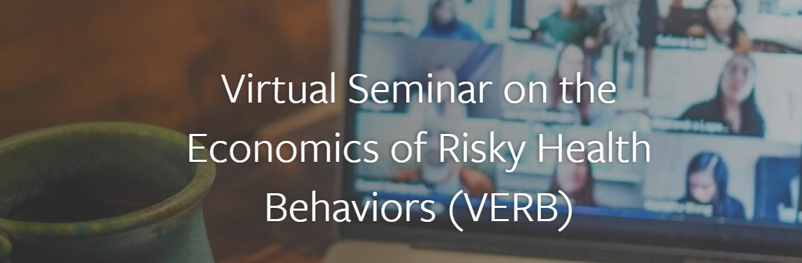

## Other Seminars

- [Tobacco Online Policy Seminar (TOPS)](https://www.tobaccopolicy.org) which is an online seminar series on nicotine-tobacco policies, with a particular focus on emerging tobacco products and modified risk tobacco products.

- The [Virtual Seminar on the Economics of Risky Health Behaviors (VERB)](https://www.human.cornell.edu/pam/research/hehbad/worldseminars) shares information on the economics of health behaviors, including smoking, alcohol abuse, drug abuse, poor diet, physical inactivity, obesity, risky sex, self-harm, and suicide.

